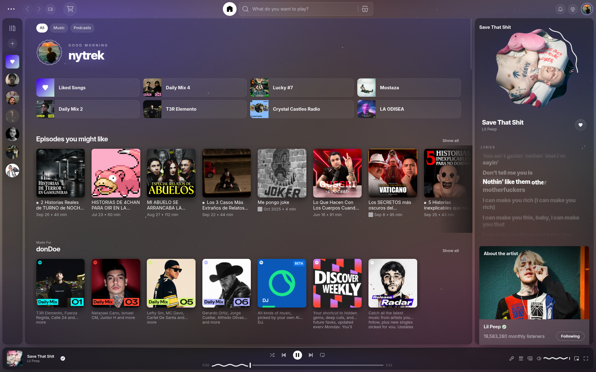
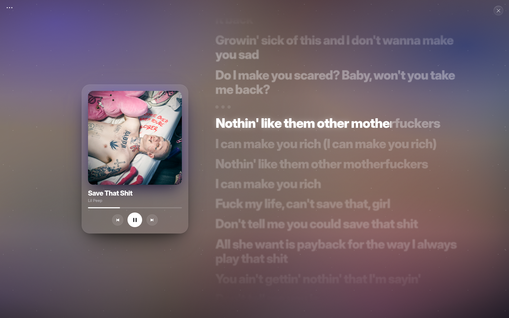
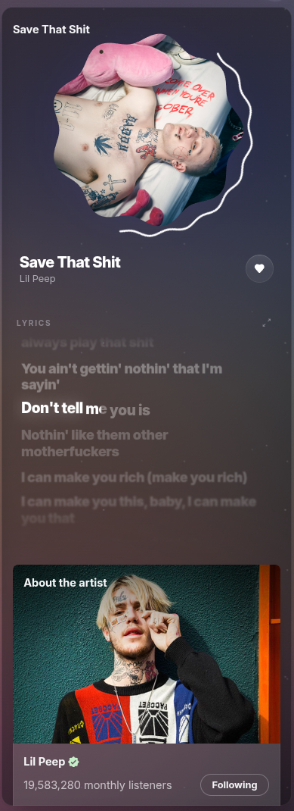
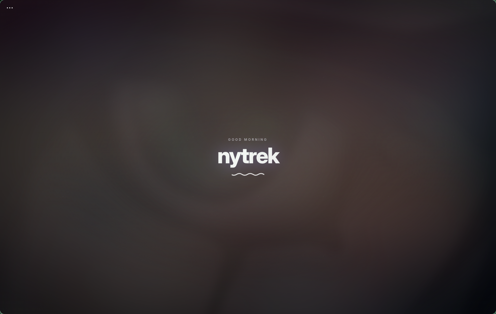
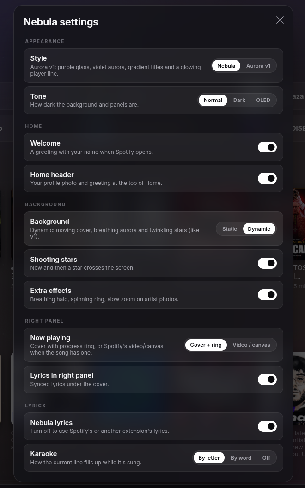

<div align="center">

# Nebula

**A glass theme for Spotify that turns the album cover into light.**

Snake progress bars · Apple Music style karaoke lyrics · Material 3 touches · A settings panel for everything

[](https://spicetify.app)
[](https://www.spotify.com/download)
[](LICENSE)
[](https://github.com/nytrek/spicetify-nebula/stargazers)



</div>

<br>

## Overview

Nebula replaces Spotify's flat panels with glass floating over an ambient light made from the song that is playing. Every color comes from the current cover and cross-fades when the track changes, while the interface itself stays neutral and white.

It ships with its own lyrics view, a redesigned Now Playing panel and a settings panel, so it can be as calm or as lively as you like and still run smoothly on integrated GPUs.

<br>

<table>
  <tr>
    <td width="50%"></td>
    <td width="50%"></td>
  </tr>
  <tr>
    <td align="center"><sub><b>Karaoke lyrics</b>: letter-by-letter fill</sub></td>
    <td align="center"><sub><b>Now Playing</b>: cookie cover inside a progress ring</sub></td>
  </tr>
  <tr>
    <td width="50%"></td>
    <td width="50%"></td>
  </tr>
  <tr>
    <td align="center"><sub><b>Welcome</b>: a greeting in Spotify's language</sub></td>
    <td align="center"><sub><b>Settings</b>: everything is optional</sub></td>
  </tr>
</table>

## Features

### Look

- **Ambient cover light.** The current artwork, pre-blurred and upscaled, glows behind the whole app and cross-fades between songs.
- **Glass everywhere.** Panels, menus, modals and the floating player dock share one soft glass material.
- **Material 3 Expressive.** Snake progress and volume bars that flatten when paused, a play button that morphs, toggles and segmented controls.
- **Welcome screen.** A localized greeting with your name when Spotify opens, followed by a staggered entrance.
- **Home header.** Your profile photo in a Material 3 "cookie" shape wrapped in a wavy ring.
- **Two styles, three tones.** The clean *Nebula* look or the violet *Aurora v1*, in normal, dark or OLED black.

### Lyrics

- **Apple Music style view.** Heavy type, the active line highlighted, the others dimmed and softly blurred.
- **Karaoke.** The current line fills up letter by letter (or word by word), and held words grow and glow.
- **In the right panel too.** Clean synced lyrics under the cover, one click away from full screen.
- **Seek by clicking a line**, scroll freely with the wheel, and it snaps back after a few seconds.
- Uses Spotify's own lyrics, and can be turned off if you prefer another lyrics extension.

### Pages

Custom treatment for Home, playlists and albums, artist pages (the header photo fades into the background), search categories, the queue, the Marketplace and [Full App Display](https://github.com/spicetify/cli/wiki/Extensions#full-app-display).

<br>

## Installation

> [!IMPORTANT]
> Nebula needs [Spicetify](https://spicetify.app) and Spotify **1.2.9x** or newer.

### Marketplace

Open **Marketplace → Themes**, search for **Nebula** and click **Install**.

### Manual

Clone the repository into your Spicetify `Themes` folder, then enable it:

<details open>
<summary><b>Linux / macOS</b></summary>

```bash
git clone https://github.com/nytrek/spicetify-nebula "$(spicetify path userdata)/Themes/Nebula"
spicetify config current_theme Nebula color_scheme Nebula inject_theme_js 1
spicetify apply
```

</details>

<details>
<summary><b>Windows (PowerShell)</b></summary>

```powershell
git clone https://github.com/nytrek/spicetify-nebula "$(spicetify path userdata)\Themes\Nebula"
spicetify config current_theme Nebula color_scheme Nebula inject_theme_js 1
spicetify apply
```

</details>

### Uninstall

```bash
spicetify config current_theme "" color_scheme ""
spicetify apply
```

<br>

## Settings

Open your **profile menu → Nebula settings**. Changes apply instantly and are remembered.

| Section | Option | Choices | Default |
| :-- | :-- | :-- | :-- |
| Appearance | Style | Nebula · Aurora v1 | Nebula |
| | Tone | Normal · Dark · OLED | Normal |
| Home | Welcome | On · Off | On |
| | Home header | On · Off | On |
| Background | Background | Static · Dynamic | Static |
| | Shooting stars | On · Off | On |
| | Extra effects | On · Off | Off |
| Right panel | Now playing | Cover + ring · Video / canvas | Cover + ring |
| | Lyrics in right panel | On · Off | On |
| Lyrics | Nebula lyrics | On · Off | On |
| | Karaoke | By letter · By word · Off | By letter |

**Dynamic** background brings back the moving cover, breathing aurora and twinkling stars. **Extra effects** adds a breathing halo under the player, a spinning progress ring and a slow zoom on artist photos. Both look best with a dedicated GPU.

<br>

## Performance

Nebula was profiled inside Spotify with Chromium traces, and its defaults are tuned for integrated graphics:

- **No live full-screen blur.** The cover arrives already blurred at 64 px and the browser upscales it.
- **Almost nothing loops.** A running `transform` animation makes Spotify recompute hundreds of `IntersectionObserver`s every frame, so shooting stars only animate while they fly.
- **Karaoke runs only while lyrics are visible and music is playing**, driven by a clock that never rewinds.
- **Fixes a Spotify bug** where a hidden loading spinner spins forever and keeps the main thread busy while idle.

When paused, the theme uses no measurable CPU. Everything heavier is opt-in through the settings.

<br>

## Compatibility

| | |
| :-- | :-- |
| Spotify | 1.2.9x (tested on 1.2.96) |
| Spicetify | 2.40 or newer (tested on 2.45) |
| Platforms | Linux, Windows, macOS |
| Languages | Greeting in 18 languages; settings and lyrics UI in English, Spanish and Portuguese |
| Works with | Full App Display |

Other lyrics extensions (Beautiful Lyrics, Spicy Lyrics, lyrics-plus) work too. Turn off **Nebula lyrics** to avoid two lyrics views.

<br>

## Troubleshooting

<details>
<summary><b>The theme loads but there is no ambient cover, welcome or lyrics</b></summary>

`theme.js` is not being injected. Run `spicetify config inject_theme_js 1` and `spicetify apply`.
</details>

<details>
<summary><b>An old snippet or theme is still visible</b></summary>

Remove any Marketplace snippet that styles the same elements, and make sure no other theme's `user.css` is active.
</details>

<details>
<summary><b>Spotify feels slow</b></summary>

Set **Background** to *Static* and turn off **Extra effects**. Heavy third-party extensions with animated backgrounds can also be the cause.
</details>

<details>
<summary><b>Something looks broken after a Spotify update</b></summary>

Spotify changes its class names from time to time. Run `spicetify backup apply` and open an issue with a screenshot.
</details>

<br>

## Support

If Nebula made your Spotify a little nicer, consider leaving a star. It helps other people find the theme.

<p>
  <a href="https://github.com/nytrek/spicetify-nebula"></a>
  &nbsp;
  <a href="https://github.com/nytrek"></a>
</p>

Found a bug or have an idea? [Open an issue](https://github.com/nytrek/spicetify-nebula/issues).

## Contributing

Issues and pull requests are welcome. See [docs/DEVELOPMENT.md](docs/DEVELOPMENT.md) for the project layout, how to debug inside Spotify and the performance rules the theme follows.

## Credits

- The snake progress bar and cookie cover follow Google's **Material 3 Expressive** and the [caelestia](https://github.com/caelestia-dots) shell.
- The lyrics view is inspired by **Apple Music**.
- Typography: [Inter](https://rsms.me/inter/) by Rasmus Andersson.

## License

[MIT](LICENSE)
